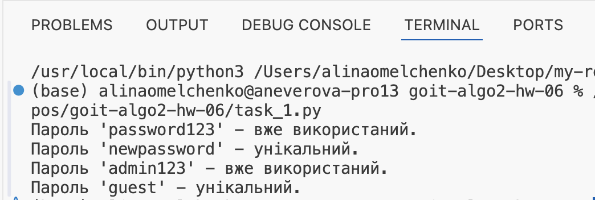
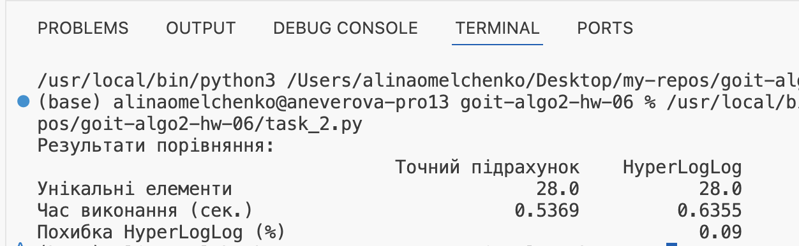

### Завдання 1

На скріншоті показано результат перевірки унікальності паролів за допомогою фільтра Блума.

### Завдання 2

На скріншоті показано таблицю порівняння точного підрахунку унікальних IP-адрес та підрахунку за допомогою HyperLogLog.

